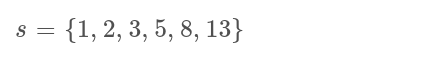
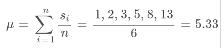
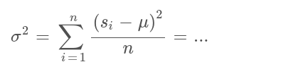
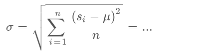

# Exercise EX2.2

This exercise is part **2** of 3 parts of EX2. See also [Item 000](https://cppitems.github.io/#/item/000) for an overview and deadlines. The submission deadline for EX2 (all three parts) is **Mo 29.11.2021, 4pm**. The sources related to EX2.2 are available at [https://github.com/cppitems/ex2.2](https://github.com/cppitems/ex2.2).

## Task 1

Your first task is to implement a *user-defined type* `Distribution` which holds the *arithmetic mean* and the *standard deviation* of a distrubtion.

For an explanation of how to calculate the *arithmetic mean* and the *standard deviation*, see the end of this text.

The type you implement must be called `Distribution` and be a `class` or `struct` template with:
- a single template type, so `template<class T> class {};` or `template<class T> struct {};`
- two public member variables `mean` and `stddev`, both of type `T`
- a public member typedef `value_type` which aliases the template parameter
- two constructors:
  - `Distribution(T, T)` which sets the two member variables
  - `Distribution(const std::vector<T> &)` which calculates the two member variables from the elements of a `std::vector<T>`

The two constructors must be able to implicitly deduce the template parameter `T` of your type.
Both constructors must be able to support the following types for `T`:
- `double`
- `float`
- `long`
- `SpaceVector<double, 3>` (from `SpaceVector.hpp`)

**Hint**: `SpaceVector` already supports the required operators to calculate the mean and standard deviation.
If you want to calculate the square root, you can use `sqrt` (**not** `std::sqrt`) which is also available in `<cmath>` for built-in types and has been defined in `SpaceVector.hpp` for `SpaceVector<T>`. Background: It is not allowed to implement anything in the `std` namespace (i.e., overloading `std::sqrt` for user-defined types).

**Hint**: When accessing the elements of the passed `std::vector` object, ideally you would use generic access methods from the beginning (i.e., range-base for loops or iterators), so you do not have to change your code for Task 2.

## Task 2

The second task is to extend the constructor `Distribution(const std::vector<T> &)` to be able to support the calculation of *arithmetic mean* and *standard deviation* from other containers as well.
At least the following container types should be supported:
- `std::vector`
- `std::list`
- `std::deque`

The template parameter `T` must still be deduced implicitly, so without providing it directly. 
**Hint**: For standard library containers this can be achieved by using either their first template parameter or their member typedef `value_type`.
In order to do this, your constructor must also be templated and `T` deduced from the passed container template using the template directly or using a deduction guide.

## Testing

As usual, you are provided with several tests, which should guide you through the exercise.
Completing them in order will be the simplest approach:
- TestA_ClassMembers.cpp
- TestB_Vector.cpp
- TestC_SpaceVector.cpp
- TestD_List.cpp
- TestE_Deque.cpp

## Benchmark

A simple benchmark is provided in `src/benchmark.cpp` which will generate random distributions with varying types and use your `Distribution` type to find the *arithmetic mean* and the *standard deviation*.
In order to build this benchmark, you have to turn it on in CMake:
```bash
cmake .. -D BUILD_BENCHMARK=ON
```

## Calculating *arithmetic mean* and *standard deviation*

Let's assume we have a set of numbers: 



### Arithmetic Mean

The arithmetic mean is simply the average of all values in a distribution:



### Standard Deviation

First, we find the *variance* which is the square of the *standard deviation*.
It is given by the average of the squared difference of each element to the mean:



The square root of the variance is the standard deviation:

